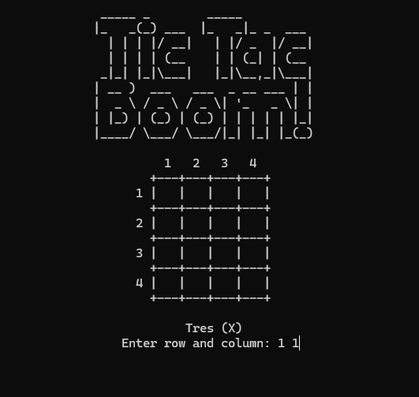

# Tic Tac Boom! - A 4x4 Board Game

This C program implements a unique 4x4 board game involving three roles: Uno, Dos, and Tres. The game features specific winning conditions and turn-based gameplay.

## Game Description

The game is played on a 4x4 grid. Uno and Tres place pieces ('O' and 'X', respectively), while Dos removes them. The game has unique winning conditions based on specific patterns on the board. 

## Terminal Screenshot

### Winning Conditions

A player wins if they align their pieces in the following patterns:

* Top row
* Bottom row
* Left diagonal
* Right diagonal

It is important to note that for Uno or Tres to win, their pieces must *exclusively* form one of the winning patterns. If they have pieces outside these patterns, even if the pattern is formed, they do not win.

### Game End

The game ends when:

* Uno or Tres wins by achieving a winning pattern.
* Dos wins because the board is full, and neither Uno nor Tres has won. 

## How to Play

1.  The game starts with Tres ('X') making the first move. 
2.  Players take turns in the sequence: Tres, Uno ('O'), Dos (remove). 
3.  To make a move, enter the row and column number separated by a space (e.g., "1 2").
4.  Input must be valid integers. [cite: 40]
5.  Uno and Tres place their respective symbols on empty cells. Dos removes a piece from an occupied cell. 
6.  The game continues until one of the winning conditions is met or the board is full.

## Code Description

The program is structured with the following functions:

* `displayMap()`: Clears the console and displays the current state of the game board. It handles the formatting of the grid and replaces null characters with spaces for display purposes. 
* `checkFree()`: Checks if there are any free cells left on the board.
* `checkWin()`: Determines if any player has won the game by checking for the winning patterns.
* `main()`:  Initializes the game, manages the game loop, takes player inputs, updates the board, and declares the winner. It uses boolean flags (`turn` and `go`) to control the turns. 

## Dependencies

* stdio.h
* stdlib.h
* conio.h (Note: For macOS or Linux, you may need to replace `system("cls")` with `system("clear")` and find an alternative for `getch()`). 

## Compilation

To compile the program, use a C compiler (e.g., GCC):
